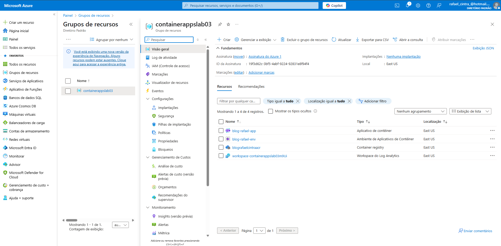
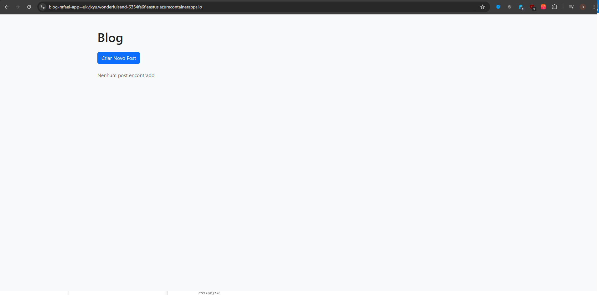

# 📝 Blog Containerizado no Azure

Este projeto é uma aplicação web simples de **Blog estático** hospedada em um **container Docker** e implantada no **Azure Container Apps**, com a imagem armazenada no **Azure Container Registry (ACR)**.

## 🚀 Funcionalidades

✅ Estrutura de páginas HTML para exibição de posts  
✅ **Dockerfile** para empacotar a aplicação em um container  
✅ Deploy da aplicação no **Azure Container Apps**  
✅ Armazenamento da imagem no **Azure Container Registry (ACR)**  
✅ Interface web responsiva e leve

---

## 🛠️ Tecnologias utilizadas

- **HTML5**
- **CSS3**
- **Docker**
- **Nginx (base image)**
- **Azure Container Registry (ACR)**
- **Azure Container Apps**
- **Git & GitHub**

---

## 📸 Comprovantes do Deploy

| Deploy no Azure | Acesso via Navegador |
|:---------------:|:-------------------:|
|  |  |

---

## 📂 Estrutura do projeto

```bash
Blog/
 ├── html/
 │   ├── index.html
 │   ├── create-post.html
 │   └── post-detail.html
 ├── Dockerfile
 └── scripts.ps1
🐳 Como rodar localmente com Docker
1️⃣ Clone o repositório:

bash
Copiar
Editar
git clone https://github.com/rafael-cintra6/blog-henrique-app.git
cd blog-henrique-app
2️⃣ Construa a imagem:

bash
Copiar
Editar
docker build -t blog-henrique-app:latest .
3️⃣ Rode o container:

bash
Copiar
Editar
docker run -d -p 8080:80 blog-henrique-app:latest
4️⃣ Acesse no navegador: http://localhost:8080

☁️ Deploy no Azure Container Apps
A imagem foi enviada para o Azure Container Registry e a aplicação foi implantada no Azure Container Apps, garantindo escalabilidade e alta disponibilidade.

📝 Comandos principais utilizados:

bash
Copiar
Editar
az acr login --name <nome-do-acr>

docker tag blog-henrique-app:latest <acr-name>.azurecr.io/blog-henrique-app:latest

docker push <acr-name>.azurecr.io/blog-henrique-app:latest

az containerapp env create --name <env-name> --resource-group <resource-group> --location eastus

az containerapp create --name <app-name> --resource-group <resource-group> \
  --image <acr-name>.azurecr.io/blog-henrique-app:latest \
  --target-port 80 --ingress external --environment <env-name> \
  --registry-server <acr-name>.azurecr.io --registry-username <acr-username> --registry-password <acr-password>
📚 O que eu aprendi
✨ Como criar um container Docker a partir de uma aplicação web simples
✨ Como configurar o Azure Container Registry (ACR) e publicar imagens
✨ Como implantar um container no Azure Container Apps
✨ Como configurar permissões de push e pull no ACR
✨ Como usar o Azure CLI para gerenciar recursos de containers

🎯 Próximos passos
✅ Adicionar backend dinâmico (por exemplo, Node.js ou Flask)
✅ Conectar com um banco de dados (Azure SQL, Cosmos DB, etc.)
✅ Implementar CRUD completo de posts
✅ Adicionar CI/CD com GitHub Actions

✍️ Autor
Projeto desenvolvido por Rafael Cintra de Araújo
🔗 LinkedIn | 📧 rafael.cintra6@gmail.com
